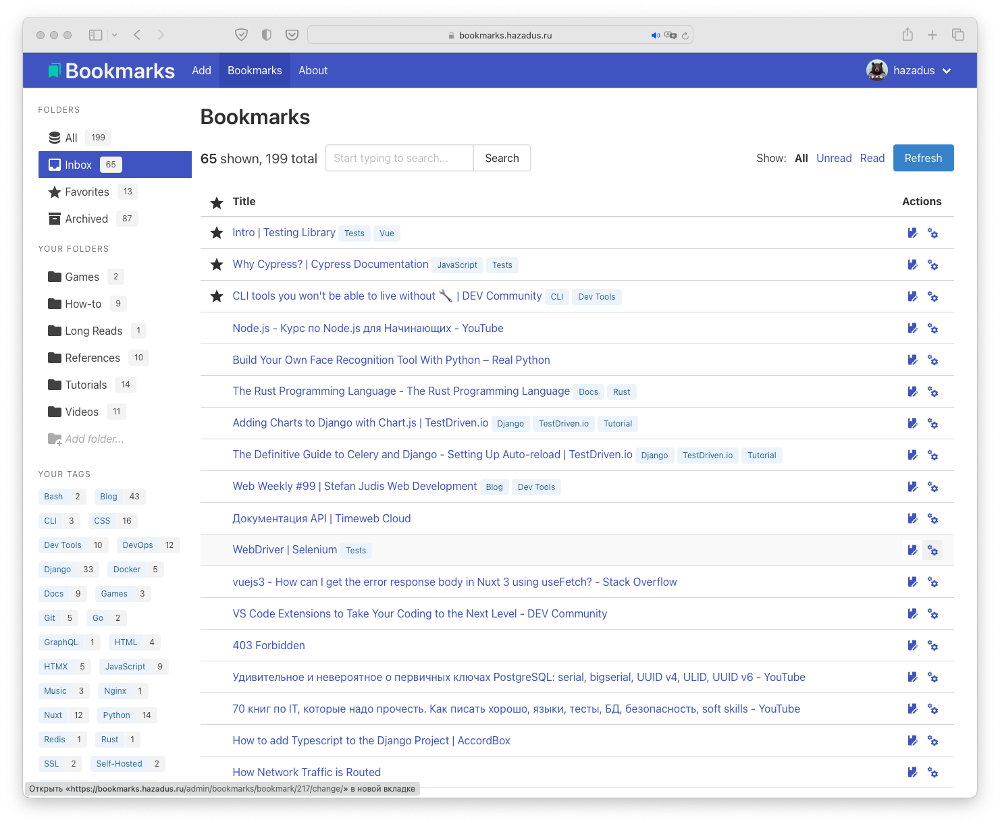

# drf-nuxt-bookmarks

Web bookmarking service consisting of Django REST Framework API backend, Telegram bot to receive URLs, Celery worker 
(process background tasks, e.g. downloads and Telegram notifications), and Nuxt/Vue frontend, written in TypeScript.

The project is in development right now! Recent changes are listed in [changelog.md](./changelog.md).

Any questions or ideas are welcome in project's [Issues](https://github.com/hazadus/drf-nuxt-bookmarks/issues) on 
GitHub.

What's already done and what's planned in terms of app features and used technologies - 
see [GitHub project page](https://github.com/users/hazadus/projects/4/views/1) and
read [this discussion thread](https://github.com/hazadus/drf-nuxt-bookmarks/discussions/55) (in Russian).

You can check out the live demo (which I use myself and update daily) here: https://bookmarks.hazadus.ru/.



## Tech stack used

### Frameworks and libraries

- Backend: [Django](https://www.djangoproject.com/)
  - [Django REST Framework](https://www.django-rest-framework.org/): REST API on the backend was built using this 
    battle-tested framework. It's powerful, well-documented and easy to use.
  - [djoser](https://djoser.readthedocs.io/en/latest/introduction.html): REST implementation of Django 
    authentication system. `djoser` library provides a set of Django Rest Framework views to handle basic actions 
    such  as registration, login, logout, password reset and account activation.
  - [django-cors-headers](https://github.com/adamchainz/django-cors-headers): Django app for handling the server 
    headers required for Cross-Origin Resource Sharing (CORS).
- [Celery - Distributed Task Queue](https://docs.celeryq.dev/en/stable/index.html): Celery is a simple, flexible, 
  and reliable distributed system to process vast amounts of messages, while providing operations with the tools 
  required to maintain such a system. 
- Telegram bot: [pyTelegramBotAPI](https://pypi.org/project/pyTelegramBotAPI/)
  - [requests](https://requests.readthedocs.io/en/latest/): Requests allows you to send HTTP/1.1 requests extremely 
    easily. There’s no need to manually add query strings to your URLs, or to form-encode your POST data.
- Frontend:
  - [Nuxt 3](https://nuxt.com/)
    - [@pinia/nuxt](https://pinia.vuejs.org/ssr/nuxt.html): [Pinia](https://pinia.vuejs.org/) state management library.
    - [@vueuse/nuxt](https://nuxt.com/modules/vueuse): Collection of essential Vue Composition Utilities.
    - [nuxt-icon](https://nuxt.com/modules/icon): Icon module for Nuxt with 100,000+ ready to use icons from Iconify.
      - [Icones](https://icones.js.org) catalogue.
  - [Bulma](https://www.npmjs.com/package/bulma): [Bulma](https://bulma.io/) is a modern CSS framework based on Flexbox.

### Dev Tools

- VS Code + Volar for frontend development.
- PyCharm Professional for backend development.
  - BlackConnect plugin.
- [Selenium](https://selenium-python.readthedocs.io/installation.html) for functional tests.
  - [xPath Finder](https://addons.mozilla.org/en-US/firefox/addon/xpath_finder/) for Firefox - plugin to get the 
    elements xPath.

## References

Some interesting resources that I found and used while developing this project.

- Nuxt
  - [Exposing Runtime Config](https://nuxt.com/docs/guide/going-further/runtime-config)
  - [Routing / Route Middleware](https://nuxt.com/docs/getting-started/routing#route-middleware)
- Vue
  - [TypeScript with Composition API](https://vuejs.org/guide/typescript/composition-api.html)
    - [Typing component props](https://vuejs.org/guide/typescript/composition-api.html#typing-component-props)
- Celery
  - [Asynchronous Tasks with Django and Celery | TestDriven.io](https://testdriven.io/blog/django-and-celery/)

## Notes

### Backend

- [Serializers: Dealing with nested objects](https://www.django-rest-framework.org/api-guide/serializers/#dealing-with-nested-objects).
- [Serializers: Partial updates](https://www.django-rest-framework.org/api-guide/serializers/#partial-updates).
  - [StackOverflow: Django Rest Framework partial update](https://stackoverflow.com/a/41112919).
- Issue: [DRF ImageField serializes entire URL with domain name](https://forum.djangoproject.com/t/drf-imagefield-serializes-entire-url-with-domain-name/6975).
  - [Overriding serialization and deserialization behavior](https://www.django-rest-framework.org/api-guide/serializers/#to_representationself-instance).
- To pass auth token in the tests, you can use the following syntax: `self.client.get(url, **{"HTTP_AUTHORIZATION": 
  "Token " + self.auth_token})`. See [answer on SO](https://stackoverflow.com/a/58174009/20197519) for further details.
- [DRF Object level permissions](https://www.django-rest-framework.org/tutorial/4-authentication-and-permissions/#object-level-permissions)
- Issue: [Deleting an model instance doesn't call the delete() method of related instances (even though they are 
  removed)](https://code.djangoproject.com/ticket/12034).
  - [Django signals - post_delete](https://docs.djangoproject.com/en/4.0/ref/signals/#post-delete)

### Frontend

Naming Conventions: "The" in the component name means there's intended to be only one instance of this component in 
the app, e.g., `TheNavbar` and `TheFooter`.

To hide dropdown menu in navbar when navigating from page to page, add `key` param like: `<div 
class="navbar-dropdown is-right" :key="route.path">`.

## How to start the project

The project consists of three parts - backend, frontend, and the Telegram bot - and you need to run them simultaneously.

First of all, you have to clone the repository to your local directory:

```bash
git clone https://github.com/hazadus/drf-nuxt-bookmarks
```

### Start in Development mode

#### Backend (API)

In first shell window, create Python virtual environment for backend and install project dependencies:

```bash
cd ./drf-nuxt-bookmarks/backend/
python3 -m venv .venv
source .venv/bin/activate
pip install -r requirements.txt
```

Then, create `.env` file using `touch ./.env` shell command, say `nano ./.env` and fill inn the necessary
environment variables:

| Variable            | Description                                                              |
|---------------------|--------------------------------------------------------------------------|
| SECRET_KEY          | Standard Django secret key string. See below how to easily generate one. |
| DEBUG               | `True` since we are in development mode.                                 |
| BACKEND_HOST        | Used in `ALLOWED_HOSTS` Django setting. `127.0.0.1` by default.          |
| BACKEND_HOST_DOCKER | Set `api` by default for now, I'll explain the meanin later!             |

To create random `SECRET_KEY`, open Django `shell` with following commands and then execute the code below:

```bash
source .venv/bin/activate
python -m manage shell
```
```python
# Inside the shell:
import secrets
print(secrets.token_urlsafe())
# It will print something like:
# U9d7Aqac7Feo8dUyy-I4A1ppAGbwj4PUmrd8_uPSu9g
# Copy it and use as your SECRET_KEY.
```

Now we are ready to migrate the database, create admin user account, and start the server:

```bash
python -m manage migrate
python -m manage createsuperuser
python -m manage runserver
```

#### Frontend (Nuxt Dev Server)

In second shell window, `cd` to `frontend` directory and create `.env` file:

```bash
cd ../frontend
touch ./.env
nano ./.env
```

Put one line there - `NUXT_PUBLIC_API_BASE=http://127.0.0.1:8000`. This will tell frontend, where to find the API.

```bash
npm install
npm run dev
```

Then, install the dependencies for Nuxt app, and run the frontend development server:

Visit `http://localhost:3000` in your browser to see the working project.
Django admin panel is available at `http://127.0.0.1:8000/admin/`.

#### Telegram bot

In the third terminal, `cd ./bot`, `touch ./.env` to create config file, and then edit it with `nano ./.env`:

```
BOT_TOKEN=your_telegram_bot_token
API_BASE_URL=http://127.0.0.1:8000
```

Then activate the virtual environment, and run the bot:

```bash
source ../frontend/.venv/bin/activate
python main.py
```

## Deploy

### Running with Docker Compose on Ubuntu

- Install Docker & Docker Compose:
  - [Install Docker](https://www.digitalocean.com/community/tutorials/how-to-install-and-use-docker-on-ubuntu-22-04)
  - [Install Docker Compose](https://www.digitalocean.com/community/tutorials/how-to-install-and-use-docker-compose-on-ubuntu-22-04)
- Use Docker Compose template files in the project directory to create your `docker-compose.yml`.
- Edit environment variables accoring according to your system parameters. Don't create `.env` files, all variables 
  must be set in `docker-compose.yml`, which is very convenient.
- Example of my "production" `docker-compose.yml`:
```
version: "3.9"
services:
  api:
    container_name: "bkmrks-api"
    build: ./backend/
    command: gunicorn django_project.wsgi -b 0.0.0.0:8000
    volumes:
      - ./backend:/code
    environment:
      - "SECRET_KEY=your_secret_key"
      - "DEBUG=False"
      - "BACKEND_HOST=bookmarks.hazadus.ru"
      - "FRONTEND_URL=https://bookmarks.hazadus.ru"
      - "BACKEND_HOST_DOCKER=api"
      - "SENTRY_DSN=your_sentry_dsn"
  bot:
    container_name: "bkmrks-bot"
    build: ./bot/
    command: python main.py
    volumes:
      - ./bot:/code
    environment:
      - "BOT_TOKEN=your_bot_token"
      - "API_BASE_URL=https://bookmarks.hazadus.ru"
  node:
      container_name: "bkmrks-node"
      build: ./frontend/
      command: node .output/server/index.mjs
      environment:
        - "NUXT_PUBLIC_API_BASE=https://bookmarks.hazadus.ru"
        - "NITRO_HOST=0.0.0.0"
        - "NITRO_PORT=3000"
  nginx:
    container_name: "bkmrks-nginx"
    image: nginx:1.23-alpine
    ports:
      - "443:443"
      - "80:80"
    volumes:
      - ./backend:/code
      - ./docker/nginx/logs:/var/log/nginx
      - ./docker/nginx/default.conf:/etc/nginx/conf.d/default.conf
      - ./docker/nginx/nginx.conf:/etc/nginx/nginx.conf
      - ./backend/media:/media
      - ./backend/staticfiles:/staticfiles
      - /etc/letsencrypt/archive/bookmarks.hazadus.ru/:/certs
    depends_on:
      - api
```
- For the first time, start project with `docker compose up -d --build` from the project directory.
- Issue following commands to run `bash` inside `api`'s container and migrate the database, create superuser and 
  collect static files:
```bash
docker exec -it bkmrks-api bash
python -m manage migrate
python -m manage createsuperuser
python -m manage collectstatic
```
- Restart project with `docker compose down`, then `docker compose up -d`.
- Enjoy! 😃

